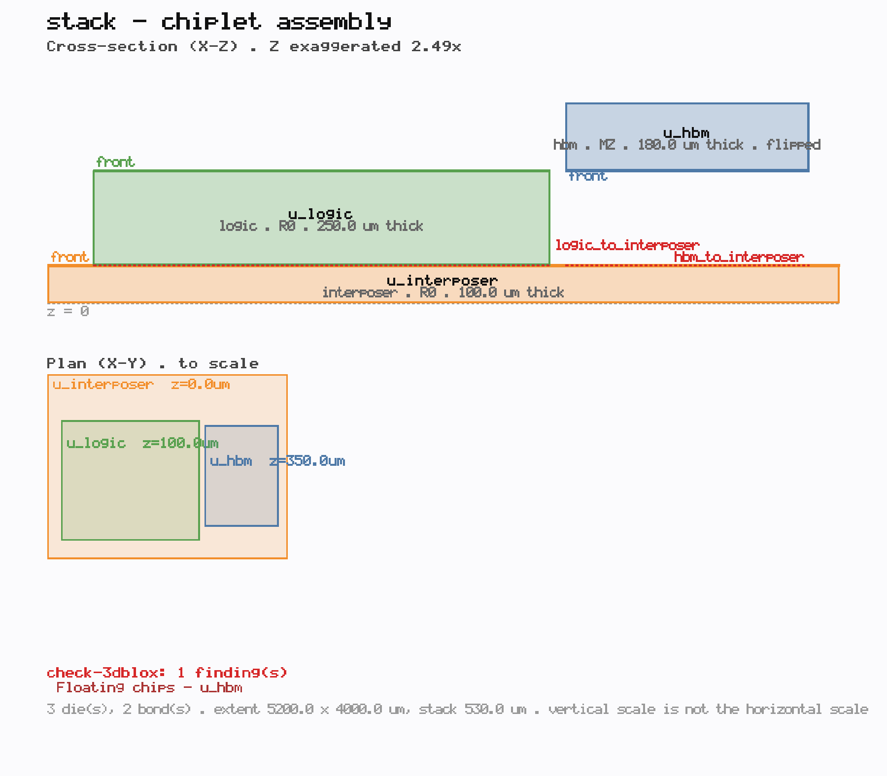
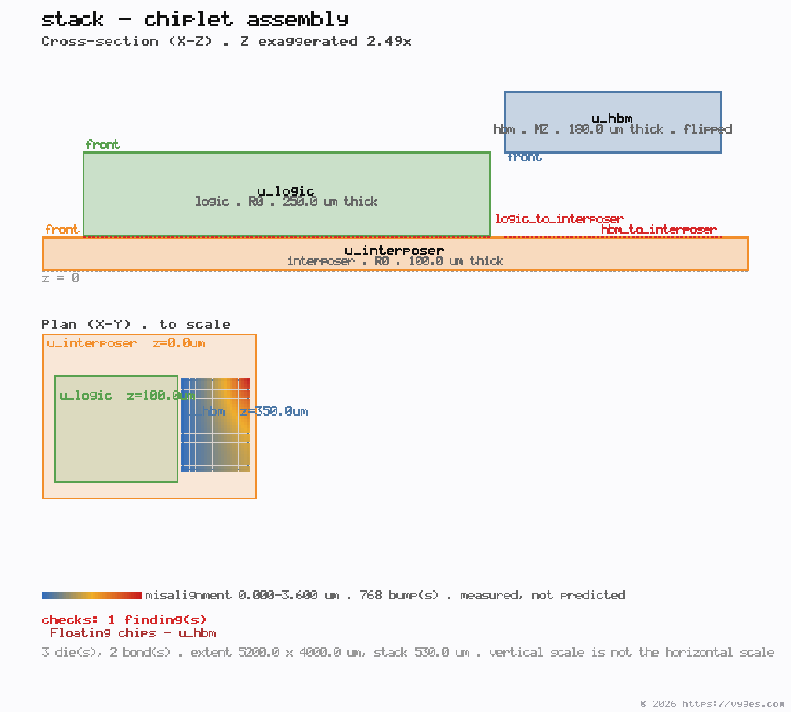

# vyges-opendb

A safe, ergonomic Rust API over OpenROAD's OpenDB (`libodb`), built on the low-level
[`vyges-opendb-lib`](https://github.com/vyges-tools/opendb-lib) FFI — no Tcl, no SWIG, no
OpenROAD engines. Runs on linux/x86_64, linux/arm64, and macOS/Apple Silicon.

> Part of Vyges Loom. This is the layer Loom steps and the ECO applier use — idiomatic Rust
> over the in-memory design database, with the OpenROAD engines driven separately.

## API

```rust
use vyges_opendb::Db;

let mut db = Db::open("design.odb")?;
println!("{} — {} insts", db.block_name(), db.num_insts());

// ECO: insert a buffer on a pin (legalization delegated to the engines separately)
let buf = db.find_master("buf");
db.insert_buffer("inst42", "A", &buf, "eco_buf0", 10_000, 10_000)?;

db.write("design_eco.odb")?;
```

- `&self` for reads, `&mut self` for edits — the borrow checker enforces no read-while-mutate.
- Errors are typed (`vyges_opendb::Error`) and carry the OpenDB message.
- Write primitives: `create_net`, `create_inst`, `set_inst_location`, `connect`, `disconnect`,
  plus the composed `insert_buffer` — the `InsertECOBuffers` building blocks.

## 3D / chiplet reads

The ODB 3D-IC schema is exposed alongside the flat one, through the same generic `get` /
`fields` surface as everything else: chips and chip insts, bonding regions, bumps, 3D
connections/nets/paths, and the **unfolded** model — the stack flattened to absolute
positions, where a bump reports its real x/y/z in the assembly.

Keys follow the hierarchy: a `dbChip` by name, a `dbChipInst` by **parent chip + inst** (inst
names are unique only within their parent), a `dbChipBump` by chip + region + index, and the
unfolded classes by the slash-joined chip-inst path.

```sh
vyges-opendb get -i stack.odb --class dbChip --field get_chip_type --key stack
# "HIER"

# a chip inst takes both keys, parent first
vyges-opendb get -i stack.odb --class dbChipInst --field get_loc_z --key stack --key u_top
# 3000

# a bump's ABSOLUTE position in the assembled stack (unfolded: path, region idx, bump idx)
vyges-opendb get -i stack.odb --class dbUnfoldedChipBumpInst \
  --field get_global_position_z --key u_top --key 0 --key 0
```

Three behaviours worth knowing before you rely on them:

- **Chip type comes back UPPERCASE** — `DIE`, `RDL`, `IP`, `SUBSTRATE`, `HIER` — matching the
  rest of our enums (`dbSigType` → `"SIGNAL"`) and OpenROAD's Python bindings. odb ships no
  `getString()` for this type, so the mapping is generated. **The 3Dblox *file* format spells
  these lowercase** (`die`, `hier`); that is the `.3dbv` writer's representation, not the
  database API's, so the two differ deliberately. Anything reading or writing 3Dblox files
  needs the lowercase form — don't reconcile them.
- **The unfolded classes answer straight after `open`,** even though they are derived and never
  stored — OpenDB rebuilds them on read whenever the database holds more than one chip. They
  come back empty if the database's top chip is not the assembly, since that is where the
  builder starts.
- **Place chip insts with `place_chip_inst`, not the raw setters.** `dbChipInst::setLoc` is
  orientation-dependent: it stores a delta computed against the orientation current at the time
  of the call, and `get_loc_*` re-applies whatever the orientation is now — so placing a chip
  and *then* re-orienting it silently moves it, with no error.
  `db.place_chip_inst(chip, inst, orient, x, y, z)` orients first and then places, so the
  location reads back exactly as passed. (Under `--features gen-write`.)

## 3D structural sign-off

Three commands: read an assembly, check it, look at it.

```sh
vyges-opendb read-3dblox  -i stack.3dbx -o stack.odb   # 3Dblox assembly -> database
vyges-opendb check-3dblox -i stack.odb                 # database -> findings
vyges-opendb view-3dblox  -i stack.3dbx -o stack.svg   # -> cross-section + plan drawing
```

`read-3dblox` reads a **3Dblox** file — the 2.5D/3D interchange format, `.3dbx` for the assembly
and `.3dbv` for the chiplet definitions it includes — and builds the corresponding chips, regions
and die-to-die connections.

What it cannot represent, it **names**:

```text
read-3dblox: 1 element(s) the database cannot represent:
  connection soc_to_virtual (virtual, no bottom)
```

Bump maps are read too: a region's `bmap` becomes real `dbChipBump`s in the database, so
`check-3dblox`'s **Bump Alignment** check — which had nothing to run on before, because a `.3dbx`
produced a database with no bumps — now catches a bump map whose bumps do not fit their die.

Bump masters are created **zero-sized**, and that is not laziness: odb takes a bump's position
from the instance bounding-box *centre* (`dbUnfoldedChipBumpInst::getGlobalPosition`) while a bump
map records its *origin* (`BmapWriter`). At any other size the two disagree by half the master, so
a map written out and read back would move. Zero-sized makes centre and origin the same point, so
a loaded bump sits exactly where the file says. Real cell geometry would have to come from the
`LEF_file` leg, which this phase does not read.

Three known losses, all reported rather than dropped: virtual bonds (`bot: ~`) have no bottom die
to attach to; a non-rectangular region collapses to its bounding rectangle; and a stack whose dies
are on different processes cannot be fully held, because a database carries **one** technology.
That last one is upstream's limit, not ours, and it is the reason this is honest about being an
assembly *description* rather than a heterogeneous stack.

Requires a build with `--features gen-write` — constructing an assembly goes through the L2/write
surface. Released binaries are built with it.

### The linter

`check-3dblox` runs OpenDB's 3D linter over a chiplet assembly — logical connectivity, floating
chips, overlapping dies, unused `internal_ext` regions, connection-region overlap and
mating-surface gap versus connection thickness, bump alignment, and alignment markers.

```sh
vyges-opendb check-3dblox -i stack.odb
```

```json
{ "violations": 2,
  "categories": [
    { "category": "Floating chips", "count": 1,
      "markers": [ { "name": "u_base", "comment": "Isolated chip set starting with u_base" } ] },
    { "category": "Connection regions", "count": 1,
      "markers": [ { "name": "stack:bond0, u_base.regions.back",
                     "comment": "Invalid connection bond0: u_top/front (faces BOTTOM) to u_base/back (faces BOTTOM)" } ] } ] }
```

The report is self-contained — findings, not just counts — because the markers live in the
in-memory database and are never written back, so a second command could not fetch them.
OpenDB's own `[WARNING ODB-nnnn]` lines go to **stderr**, leaving stdout parseable.

From Rust the same detail is reachable through the ordinary marker accessors — no new read path
— addressed by a slash path, since the 3D categories nest under a top category on the chip:

```rust
let db = Db::open("stack.odb")?;
if db.check_3dblox()? > 0 {
    let why = registry::get(&db, "dbMarker", "get_comment",
                            &["3DBlox/Connection regions".into(), "0".into()])?;
}
```

It is a **checker, not a repairer**: it annotates the in-memory database with markers and never
modifies the design, so `Db::check_3dblox` takes `&self` and nothing is persisted unless you
write the database out. Re-running is idempotent.

**Both checks exit non-zero when they find something**, matching every other sign-off engine in
the suite, so they gate CI directly. The report still goes to stdout — a failing job and a
readable report are not alternatives.

### The drawing

The linter says *what* is wrong. `view-3dblox` says *where* — one self-contained SVG, no server
and no GUI toolkit, which opens in a browser, commits to a repo and embeds in a report.

```sh
vyges-opendb view-3dblox -i stack.3dbx -o stack.svg    # or -i stack.odb --top <chip>
vyges-opendb view-3dblox -i stack.3dbx -o stack.png --scale 2
```

The output extension picks the format. **SVG** is exact and diffable, so it is what belongs in a
repo or a CI artifact; **PNG** is what you paste into a slide, a web page or a message. Both come
from the same scene, so they cannot drift into being pictures of different things.



*An interposer, an offset logic die, and a flipped memory die — regenerate with
`cargo run --features gen-write --example draw_stack`. The memory die sits above the bond plane,
which is why the linter reports it floating; the drawing is how you see that at a glance.*

### Where the interface is off: `--heatmap`

`check-d2d` says which bumps are wrong. `--heatmap` shades the **measured** separation of every
mated pair onto the plan view, so the *shape* of the error is visible — and shape is diagnosis. A
uniform drift across the field is a placement or thermal-expansion error; a hot corner is warpage;
scatter is overlay noise. A count cannot tell those apart.

```sh
vyges-opendb view-3dblox -i stack.3dbx -o stack.png --heatmap
```



*The same assembly with a misalignment field over the memory die — drift across X plus a lifted
corner. Regenerate with `cargo run --features gen-write --example draw_stack`. **This field is
synthetic**: the example database carries no bump maps, so there is nothing real to measure; on
real input the values come from `check-d2d`.*

**This is a measurement, not a yield prediction, and the drawing says so.** Predicting yield needs
particle density, Cu recess and surface roughness — process inputs no layout carries. What this
gives you is the layout-side input a yield model (such as UCLA's YAP, integrated into OpenROAD
over a file interface) consumes. `check-d2d --json` emits the same numbers per finding —
`x_um`, `y_um`, `distance_um`, and signed `dx_um`/`dy_um` — so you can feed one or plot your own.

It draws two views, because one is not enough. A **plan** view shows footprints and overhang; it
cannot show stacking order, die thickness, bond gaps, or **which face is bonded** — and those are
the entire subject of an assembly. So the primary view is the **cross-section**, the drawing a
package engineer reads, with the plan below it and any linter findings listed underneath.

A die at `MZ` is flipped: its FRONT faces down. Drawing it like an `R0` die would be a plausible
picture of the wrong assembly, so flipped dies are labelled and their front edge drawn on the
correct side.

**Why this is small when a layout viewer is not.** A routed block is millions of polygons, which
is why viewing one needs a tile server and a raster pyramid. An assembly is a handful of dies,
each a box — tens of rectangles. Different problem, three orders of magnitude apart.

The Z axis is scaled to fit the page and **prints its own factor** (`exaggerated 12×` /
`compressed 0.45×`). Every package cross-section is drawn with a non-uniform Z scale; the
difference is saying so on the drawing, so nobody measures a bond gap off the picture.

Both 3D construction commands need `--features gen-write`. Released binaries have it.

## Die-to-die interface checking

A 2.5D/3D assembly lives or dies on whether the bumps on two mating faces line up and carry the
same signals. `check-d2d` compares two **bump maps** — the `.bmap` files a 3Dblox `.3dbv` points
at — and reports what does not agree.

```sh
vyges-opendb check-d2d --input stack.3dbx          # every bonded pair in the assembly
vyges-opendb check-d2d --top logic.bmap --bottom mem.bmap --offset-x -120.5 --flip-x
```

With `--input` the bump maps and the placements both come out of the 3Dblox assembly, so
**nothing about how the dies sit has to be stated on the command line** — which is where the
two-file form is easiest to get wrong. Every bonded pair is checked; a pair whose regions declare
no `bmap` is listed under `interfaces_skipped` rather than counted as clean, because "we did not
look" and "we looked and found nothing" are different answers.

```json
{ "violations": 5,
  "by_kind": { "unmated": 1, "misaligned": 1, "net-mismatch": 2, "cell-mismatch": 1 },
  "top_bumps": 4, "bottom_bumps": 3, "matched": 3,
  "tolerance_um": 19.9995, "tolerance_source": "derived from bump pitch",
  "transform": { "dx_um": -120.5, "dy_um": 0.0, "flip_x": true },
  "findings": [
    { "kind": "net-mismatch",
      "message": "bt1 carries d2d_tx1 but mates with bb1 carrying d2d_tx2" },
    { "kind": "unmated",
      "message": "top bump bt3 (d2d_tx3) at (10.000, 50.000) has no mating bump on the bottom die" } ] }
```

### Why this is not already covered

`check-3dblox` has a `Logical Connectivity` check aimed at the same thing, and its inner loop is:

```cpp
auto it = bot_bumps.find(p);   // std::map<Point,...>, exact integer-DBU equality
if (it == bot_bumps.end()) {
    continue;                  // no bump at that exact point -> skipped, silently
}
```

It compares only pairs that already coincide exactly, and skips anything without a counterpart.
Its sibling `checkNetConnectivity` is an empty function body. Measured on assemblies built for the
purpose — the numbers come from `cargo run --features gen-write --example d2d_gap`, not from
reading the source:

| interface | `check-3dblox` | `check-d2d` |
| --- | --- | --- |
| a top bump with **no mating bump at all** | 0 | **1** |
| everything mated and exactly aligned | 0 | 0 |
| a mating pair off by **1 DBU** (1 nm) | 0 | **1** |
| a mating pair off by **5 µm** | 0 | **2** |

Rows 1, 3 and 4 are dead or mis-wired silicon and all report clean today. Row 2 is the control.

### What it checks

- **unmated** — a bump with no counterpart. A signal that leaves one die and arrives nowhere.
- **misaligned** — a pair close enough to be intended mates, but not coincident; the distance is
  reported. These are exactly what upstream skips.
- **net-mismatch** — mated bumps carrying different net names. The interface is wired to the
  wrong signal.
- **cell-mismatch** — a microbump mating with a C4.

Both sides are walked, so an unmated *bottom* bump is reported too — it is just as dead.

### Two things it deliberately does not do

**In the two-file form it does not infer the placement.** Two bump maps are each in their own
die's coordinates, and nothing in the files says how the dies sit. Pass `--offset-x` / `--offset-y`
(microns) and `--flip-x` for a face-to-face bond. Either way the frame used is echoed in every
report, because "no violations" means nothing without knowing what frame produced it — and a
checker that guessed an alignment and then declared everything matched would be worse than none.

This is exactly why `--input` is the better entry point. **`MZ` does not mirror X.** It flips the
die's *face* and leaves the bump field's handedness alone; the mirror people expect from "flipped"
comes from the `MY` component, so a face-to-face die is usually `MZ_MY`. That was measured against
odb's own `dbUnfoldedChipBumpInst` global positions, not read off the names — and writing `MZ`
where `MZ_MY` was meant turns a correct interface into four net mismatches:

```text
mm_rx0 carries d2d_tx0 but mates with lg_tx3 carrying d2d_tx3
mm_rx1 carries d2d_tx1 but mates with lg_tx2 carrying d2d_tx2
...
```

Loud, which is what it should be. Reading the assembly means nobody has to make that call by hand.
An orientation the mapping has *not* been verified against is refused outright rather than
processed, because odb silently treats an unrecognised orientation as `R0` — inheriting that would
place a die wrongly and then report the interface clean.

**It does not pick a tolerance out of the air.** The default match radius is half the smaller of
the two bump pitches, derived from the maps themselves: anything nearer to a bump than that is
nearer to it than to its neighbour, so a match cannot be ambiguous. `--tolerance` overrides, and
the report says which was used. With fewer than two bumps there is no pitch to derive, so it
requires coincidence and says so.

A malformed line does not abort the file — a bump map is machine-generated but hand-edited often
enough, and refusing to check 4,095 good bumps because line 812 has five columns would make the
tool useless exactly when it is most needed. Bad lines are reported, and their bumps are not
counted as checked.

## Stack-level net continuity

`check-d2d` asks whether one interface is wired correctly. `check-3d-nets` asks whether a net is
correct across the whole stack — which no single bond can answer.

```sh
vyges-opendb check-3d-nets --input stack.3dbx    # [--tolerance <um>] [--no-tsv-inference]
```

A signal leaves die A's front face, crosses a bond into die B's back face, and has to reach die B's
front face to continue to die C. If B has no TSVs it does not — and every bond in that stack is
individually perfect, so nothing else reports it. Measured on `tests/fixtures/3dblox/nets/`, whose
two assemblies differ only in the middle die's `tsv` flag:

| on the severed stack | reports |
| --- | --- |
| `check-3dblox` *Logical Connectivity* | 0 — it compares only bumps already at coincident points |
| `check-3dblox` `checkNetConnectivity` | 0 — an empty function body upstream |
| `check-d2d` | 0 — each bond is correctly mated and correctly netted |
| `check-3d-nets` | **1 `severed`**, naming the die the net cannot cross |

```json
{ "violations": 1,
  "by_kind": { "severed": 1 },
  "nets": 2, "bumps": 6, "groups": 3, "net_source": "bump maps", "tsv_inference": true,
  "interfaces_checked": 2,
  "bonds": [ { "bond": "bond0", "top": "u_mid.back", "bottom": "u_base.front",
               "matched": 2, "tolerance_um": 20.0, "tolerance_source": "derived from bump pitch" } ],
  "findings": [
    { "kind": "severed", "net": "n_thru", "chip_inst": "u_mid", "chiplet": "mid_notsv",
      "tsv": false, "faces": ["back", "front"],
      "message": "net n_thru lands on u_mid/back and u_mid/front but is not joined between them — chiplet mid_notsv declares no TSVs, so nothing carries the net through the die" } ] }
```

Net names come from the `.bmap` files the assembly points at, and the report always says so in
`net_source` — a continuity verdict is uninterpretable without knowing which description of the
nets produced it.

### Two violations and two observations

**`severed`** and **`net-merged`** are violations and set a non-zero exit. `net-merged` is two
differently named nets that the bonding shorts together; `check-d2d` reports the same short per
interface as `net-mismatch`, and here it is one finding for the net, naming every bond that
contributes — a net shorted at three bonds is one wrong net, not three wrong interfaces.

**`unresolved`** and **`tsv-unused`** are informational and do **not** fail the run. `tsv-unused` is
a die that declares TSVs no net crosses: not a defect, but either the flag is wrong or a
through-connection was lost. `unresolved` is a net whose continuity only an **unchecked** bond could
settle — a finding that would disappear if that bond turned out to be fine is not stated as a
defect. Failing a build over missing input rather than over a defect is how a checker teaches people
to ignore it.

### A net name belongs to its own die

The `netName` column names a net in **that die's** netlist. Two instances of one chiplet both carry
a bump called `VDD`, and those are two different nets until something joins them; what joins die
nets into assembly nets is the `.3dbx`'s `external.verilog_file`, which this layer does not read. So
net identity comes from the **graph** — a shared name within one die, plus whatever the bonding
physically mates — and never from name equality across unbonded dies.

That distinction is load-bearing rather than pedantic. Grouping by name globally reports 38 split
nets on upstream's own `example.3dbx`, which instantiates one chiplet twice — every `VDD`, `VSS` and
`soc_io[n]` looks like a net in two pieces, on an assembly where **not one bonded surface carries a
bump map**. So every finding is scoped to what a single die or a single bond can settle by itself,
and anything that would need an assembly netlist is declined rather than guessed.

### What it does not do

- **It does not invent TSV geometry.** `tsv` is a per-die boolean; neither 3Dblox's chiplet header
  nor odb carries TSV locations. A through-path inside a die is inferred from net names matching
  across its two faces — sound, since both names are in the same netlist, but still a convention
  rather than a standard. `--no-tsv-inference` turns it off and every finding names the rule it
  applied.
- **It does not read a database.** `dbChipNet` exists in odb, but every traversal edge it needs is
  unbridged at our pin (`dbUnfoldedChipNet::getConnectedBumps`, `dbChipRegion::getChipBumps`, the
  `dbUnfoldedChipConn` region relations), and `dbChipBump::setNet` is too — so a database built here
  carries no chip nets at all, and a check over one would report every stack clean. A `.odb` input
  is refused with that reason rather than checked emptily.
- **It says nothing about timing.** A through-path that exists can still be unusable; 3D STA needs
  `dbChipRSeg`/`dbChipCapNode`, absent from `db.h` at our pin.
- **It never modifies anything.** Read-only, like `check-3dblox`.

A bond that is not checked — no bump map, a virtual bond, a nested instance path — is listed under
`interfaces_skipped` and reported on stderr, never counted as clean.

## Build & test

```sh
cargo test
```

The first build compiles a standalone `libodb` via `vyges-opendb-lib` (which sparse-checks-out the
pinned OpenROAD subtree and builds it — see that crate for details). Deps: a C++20 compiler +
`cmake boost zlib abseil spdlog fmt`.

## Status

Read + ECO write path over the db core (v0), plus a 3D/chiplet path: read a 3Dblox assembly,
lint it, draw it, check its die-to-die interfaces and its stack-level net continuity.
LEF/DEF/GDS I/O and richer traversal follow the
`vyges-opendb-lib` roadmap. OpenROAD is BSD-3-Clause; this crate is Apache-2.0 (see NOTICE).
